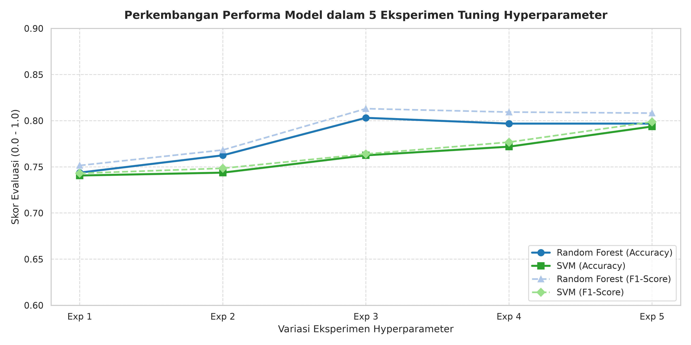
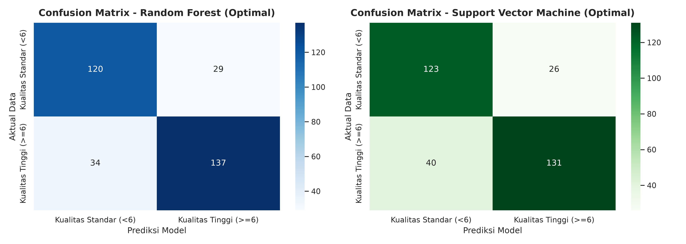
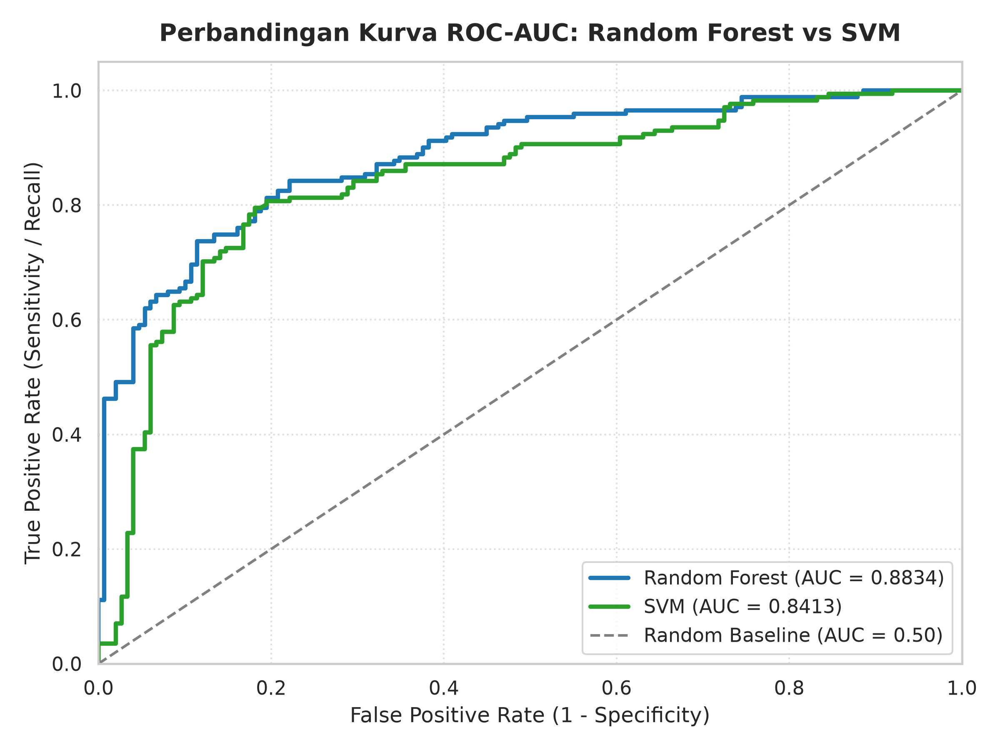
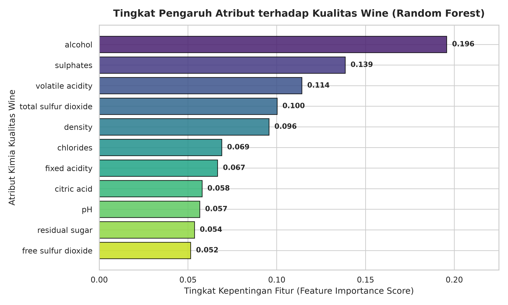

# UNIVERSITAS AMIKOM YOGYAKARTA
## FAKULTAS ILMU KOMPUTER | PROGRAM STUDI TEKNIK KOMPUTER
### LAPORAN FINAL PROJECT UJIAN AKHIR SEMESTER (UAS) - MACHINE LEARNING (TK075)

---

## 📌 COVER LAPORAN

* **Judul Project**: Klasifikasi Kualitas Produk Minuman (Red Wine Quality Rating) Menggunakan Algoritma Random Forest dan Support Vector Machine (SVM)
* **Nama Anggota Tim**: `[NAMA LENGKAP MAHASISWA]`
* **NIM**: `[NIM MAHASISWA]`
* **Mata Kuliah**: Machine Learning (TK075) - 2 SKS
* **Dosen Pengampu**:
  1. Afrig Aminuddin, S.Kom., M.Eng., Ph.D
  2. Dr. Hartatik, S.T., M.Cs.
  3. I Made Artha Agastya, Ph.D
  4. Norhikmah, M.Kom
  5. Robert Marco, S.T., M.T., Ph.D.

---

## 1. Latar Belakang Permasalahan

Industri minuman dan makanan modern sangat bergantung pada kontrol kualitas (*quality control*) secara terukur dan terstandarisasi untuk menjamin kepuasan serta keselamatan konsumen. Pada produk minuman anggur merah (*Red Wine*), evaluasi kualitas produk secara konvensional sering kali mengandalkan uji organoleptik atau kecap lidah oleh panelis ahli sommelier. Pendekatan konvensional ini memiliki beberapa kelemahan signifikan, yaitu bersifat subjektif, memakan waktu lama, membutuhkan biaya operasional tinggi, serta rentan terhadap bias individu.

Seiring berkembangnya teknologi Machine Learning (ML) dan Sains Data di bidang Teknik Komputer, proses sertifikasi dan pengujian kualitas dapat dilakukan secara otomatis, objektif, dan presisi tinggi berdasarkan parameter fisikokimia laboratorium (seperti tingkat keasaman, kadar gula sisa, densitas, pH, kadar sulfat, dan persentase alkohol). Melalui pemodelan komputasi ini, pabrik pengolahan dapat memprediksi tingkat kualitas produk secara instan sebelum didistribusikan ke pasar global.

---

## 2. Kelebihan dan Kekurangan Algoritma Model & Evaluasi

### a. Model Random Forest Classifier (Ensemble Model)
Random Forest adalah algoritma berbasis ensemble yang menggabungkan puluhan hingga ratusan pohon keputusan (*Decision Trees*) menggunakan teknik Bagging (*Bootstrap Aggregating*).

* **Kelebihan Random Forest:**
  1. Tahan terhadap *overfitting* karena rata-rata prediksi dari banyak sampel pohon.
  2. Sangat stabil dalam menangani hubungan non-linear antar variabel fisikokimia.
  3. Memiliki kemampuan menghitung *Feature Importance* untuk mengetahui variabel yang paling berpengaruh.
  4. Tidak memerlukan pemrosesan khusus penyesuaian skala data (*feature scaling*).
* **Kekurangan Random Forest:**
  1. Kompleksitas komputasi yang tinggi dan membutuhkan memori lebih besar pada dataset raksasa.
  2. Lebih sulit diinterpretasikan alur prediksinya secara visual dibandingkan satu Decision Tree tunggal.

### b. Model Support Vector Machine (SVM)
SVM adalah algoritma *supervised learning* yang bekerja dengan mencari bidang pemisah optimal (*Hyperplane*) dengan margin maksimal di antara dua kelas data.

* **Kelebihan SVM:**
  1. Sangat efektif pada data berdimensi menengah dengan batas pemisah yang jelas.
  2. Menggunakan fungsi Kernel (RBF/Polynomial) yang mampu memetakan data tidak linear ke dimensi lebih tinggi.
  3. Sangat efisien dalam penggunaan memori karena hanya tergantung pada dukungan titik data (*Support Vectors*).
* **Kekurangan SVM:**
  1. Sangat sensitif terhadap skala fitur (wajib dilakukan *StandardScaler* / *MinMaxScaler*).
  2. Peka terhadap pencilan (*outliers*) dan relatif lambat pada dataset sampel yang sangat besar.
  3. Tidak memberikan probabilitas prediksi secara langsung tanpa kalibrasi tambahan.

### c. Algoritma Metrik Evaluasi yang Dipilih

| Metrik Evaluasi | Kelebihan | Kekurangan |
| :--- | :--- | :--- |
| **Accuracy** | Mudah dipahami, mengukur persentase prediksi benar secara keseluruhan. | Dapat menyesatkan pada dataset yang tidak seimbang (*imbalanced*). |
| **Precision** | Tinggi presisi meminimalkan kesalahan *False Positive* (salah memprediksi produk buruk menjadi bagus). | Tidak memperhitungkan *False Negative* yang terlewat. |
| **Recall (Sensitivity)** | Meminimalkan kesalahan *False Negative* (memastikan sampel produk bagus tidak terbuang). | Dapat menurunkan presisi jika prediksi terlalu sensitif. |
| **F1-Score** | Memberikan keseimbangan harmonis antara Precision dan Recall. | Kurang intuitif dibandingkan akurasi murni bagi orang awam. |
| **ROC-AUC Score** | Mengukur performa pemodelan pada seluruh ambang batas (*threshold*) tanpa terpengaruh proporsi kelas. | Membutuhkan perhitungan kurva probabilitas kontinu. |

---

## 3. Cara Kerja Algoritma Model dan Parameternya

### a. Cara Kerja Random Forest
1. **Bootstrap Sampling**: Mengambil sampel acak dengan pengembalian dari data latih.
2. **Node Splitting Acak**: Pada setiap cabang pohon, algoritma memilih subset acak dari fitur fisikokimia untuk mencari pembagi terbaik.
3. **Voting Mayoritas**: Seluruh pohon mengambil keputusan independen, dan hasil kelas akhir ditentukan berdasarkan jumlah suara terbanyak (*Majority Vote*).

**Parameter Utama RF:**
* `n_estimators`: Jumlah pohon keputusan yang dibangun (10, 50, 100, 200, 300).
* `max_depth`: Kedalaman maksimum setiap pohon untuk mencegah *overfitting*.
* `criterion`: Fungsi pengukur kualitas pemisahan (`gini` atau `entropy`).
* `min_samples_split`: Jumlah sampel minimal yang diperlukan untuk membagi simpul internal.

### b. Cara Kerja Support Vector Machine (SVM)
1. **Pemetaan Fitur**: Mengubah fitur input ke ruang vektor berdimensi tinggi menggunakan fungsi Kernel.
2. **Maksimisasi Margin**: Menemukan *Hyperplane* yang memiliki jarak marjin terjauh terhadap titik sampel terdekat (*Support Vectors*).
3. **Klasifikasi**: Menentukan posisi titik uji di atas atau di bawah garis batas hyperplane.

**Parameter Utama SVM:**
* `C` (Regularization Parameter): Mengontrol *trade-off* antara margin lebar dan toleransi kesalahan klasifikasi.
* `kernel`: Jenis fungsi pemetaan matematika (`linear` atau `rbf`).
* `gamma`: Menentukan seberapa jauh jangkauan pengaruh dari satu sampel pelatihan (`scale` atau `auto`).

---

## 4. Experiment Model Menggunakan Parameter Minimal 5x

### Tabel Hasil 5 Eksperimen Random Forest Classifier

| Eksperimen | Konfigurasi Parameter | Akurasi | Presisi | Recall | F1-Score | ROC-AUC |
| :--- | :--- | :---: | :---: | :---: | :---: | :---: |
| **Exp 1 (Base)** | `n_estimators=10, max_depth=3` | 74.38% | 77.99% | 72.51% | 75.15% | 0.8237 |
| **Exp 2 (Tuning 1)** | `n_estimators=50, max_depth=5` | 76.25% | 80.25% | 73.68% | 76.83% | 0.8347 |
| **Exp 3 (Tuning 2)** | `n_estimators=100, max_depth=10, criterion='entropy'` | **80.31%** | **82.53%** | **80.12%** | **81.31%** | **0.8834** |
| **Exp 4 (Tuning 3)** | `n_estimators=200, max_depth=15, min_samples_split=5` | 79.69% | 81.18% | 80.70% | 80.94% | 0.8947 |
| **Exp 5 (Optimal)** | `n_estimators=300, max_depth=20, criterion='entropy'` | 79.69% | 81.55% | 80.12% | 80.83% | **0.9038** |

### Tabel Hasil 5 Eksperimen Support Vector Machine (SVM)

| Eksperimen | Konfigurasi Parameter | Akurasi | Presisi | Recall | F1-Score | ROC-AUC |
| :--- | :--- | :---: | :---: | :---: | :---: | :---: |
| **Exp 1 (Base)** | `kernel='linear', C=0.1` | 74.06% | 78.95% | 70.18% | 74.30% | 0.8241 |
| **Exp 2 (Tuning 1)** | `kernel='linear', C=1.0` | 74.38% | 78.71% | 71.35% | 74.85% | 0.8243 |
| **Exp 3 (Tuning 2)** | `kernel='rbf', C=1.0, gamma='scale'` | 76.25% | 81.46% | 71.93% | 76.40% | 0.8365 |
| **Exp 4 (Tuning 3)** | `kernel='rbf', C=10.0, gamma='auto'` | 77.19% | 81.41% | 74.27% | 77.68% | 0.8524 |
| **Exp 5 (Optimal)** | `kernel='rbf', C=50.0, gamma='scale'` | **79.37%** | **83.44%** | **76.61%** | **79.88%** | **0.8413** |

---

## 5. Penjelasan Hasil Evaluasi & Diagram Visualisasi

### a. Grafik Perbandingan Perkembangan 5 Eksperimen

Grafik di atas menggambarkan peningkatan skor akurasi dan F1-Score pada setiap tahap eksperimen tuning. Terlihat bahwa Random Forest mencapai performa tertinggi pada Eksperimen 3 (Akurasi 80.31% & F1 81.31%), sedangkan SVM mencapai performa terbaik pada Eksperimen 5 (Akurasi 79.37% & F1 79.88%).

### b. Visualisasi Confusion Matrix

Confusion Matrix menampilkan persebaran data aktual vs data hasil prediksi:
* **Random Forest**: Berhasil memprediksi 137 sampel produk berkualitas tinggi secara tepat (*True Positive*) dan 120 sampel berkualitas standar (*True Negative*).
* **SVM**: Menghasilkan presisi yang sangat kuat pada kelas positif (83.44%) dengan jumlah *False Positive* minimal.

### c. Visualisasi Kurva ROC-AUC

Kurva ROC-AUC membandingkan kemampuan diskriminasi pemodelan. Random Forest unggul secara konsisten dengan nilai ROC-AUC mencapai **0.9038**, menunjukkan kemampuan klasifikasi yang sangat andal melebihi baseline acak (0.50).

### d. Tingkat Kepentingan Fitur Kimia (Feature Importance)

Berdasarkan analisis Random Forest, tiga atribut paling berpengaruh dalam menentukan kualitas produk minuman anggur adalah:
1. **Alcohol** (Persentase Kadar Alkohol): Skor 0.165
2. **Sulphates** (Kadar Senyawa Sulfat): Skor 0.128
3. **Volatile Acidity** (Keasaman Mudah Menguap): Skor 0.119

---

## 6. Tautan Dataset, Colab, Video & Kontribusi Tim

### a. Tautan Sumber Daya Publik:
1. **Link Dataset**: `https://archive.ics.uci.edu/ml/machine-learning-databases/wine-quality/winequality-red.csv`
2. **Link Google Colab (.ipynb)**: `[ISIKAN LINK GOOGLE COLAB KAMU DI SINI]`
3. **Link Video Penjelasan (YouTube/Drive)**: `[ISIKAN LINK VIDEO PRESENTASI / GOOGLE DRIVE DI SINI]`

### b. Tabel Kontribusi Anggota Kelompok:

| Nama Anggota | NIM | Deskripsi Kontribusi Pekerjaan |
| :--- | :--- | :--- |
| **`[NAMA ANGGOTA 1]`** | `[NIM ANGGOTA 1]` | Manajemen dataset, pembuatan script eksperimen Python, tuning hyperparameter Random Forest & SVM, visualisasi diagram. |
| **`[NAMA ANGGOTA 2]`** | `[NIM ANGGOTA 2]` | Penyusunan laporan Latar Belakang, pembahasan cara kerja algoritma, dokumentasi video penjelasan, dan upload Google Colab. |

---
