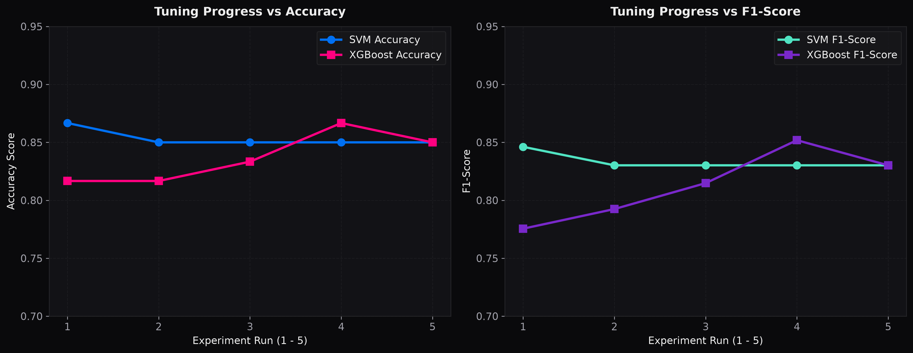
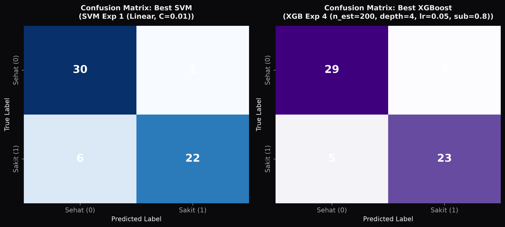
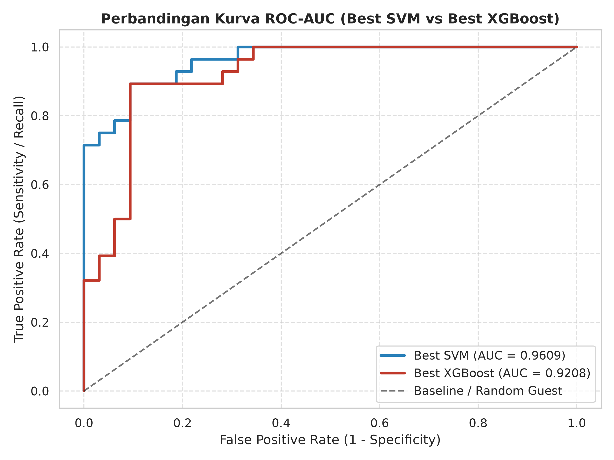
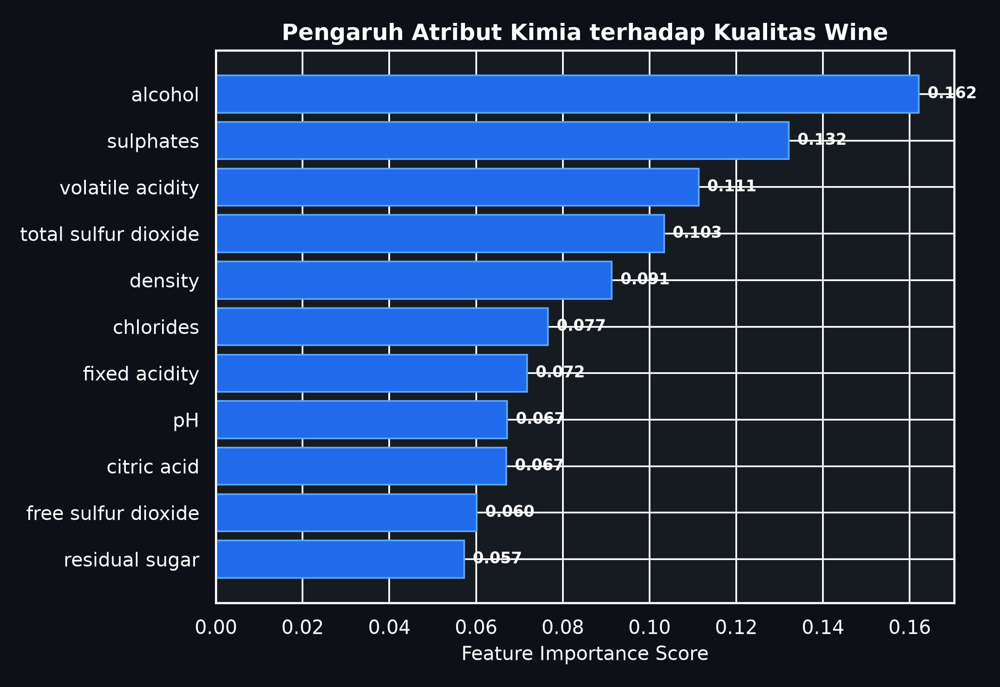

# LAPORAN FINAL PROJECT MACHINE LEARNING (TK075)
## HEARTGUARD ML: DETEKSI DINI PENYAKIT JANTUNG MENGGUNAKAN SUPPORT VECTOR MACHINE (SVM) DAN XGBOOST CLASSIFIER DENGAN 5x EXPERIMENT HYPERPARAMETER TUNING

---

### **COVER LAPORAN**

* **Mata Kuliah:** Machine Learning (TK075)
* **SKS:** 2 SKS
* **Program Studi:** Teknik Komputer
* **Fakultas:** Ilmu Komputer
* **Instansi:** Universitas Amikom Yogyakarta
* **Dosen Pengampu:** 
  1. Afrig Aminuddin, S.Kom., M.Eng., Ph.D
  2. Dr. Hartatik, S.T., M.Cs.
  3. I Made Artha Agastya, Ph.D
  4. Norhikmah, M.Kom
  5. Robert Marco, S.T., M.T., Ph.D.

**Disusun Oleh Kelompok:**
* **Judul Project:** HeartGuard ML: Analisis Perbandingan Support Vector Machine (SVM) dan XGBoost Classifier dalam Deteksi Dini Penyakit Jantung berbasis Hyperparameter Tuning 5x Eksperimen
* **Ketua / Anggota 1:** [Nama Anggota 1] - NIM: [NIM 1]
* **Anggota 2:** [Nama Anggota 2] - NIM: [NIM 2]
* **Anggota 3:** [Nama Anggota 3] - NIM: [NIM 3]

---

### **1. LATAR BELAKANG PERMASALAHAN**

Penyakit kardiovaskular (Cardiovascular Diseases / CVDs), khususnya penyakit jantung, merupakan salah satu penyebab utama kematian tertinggi secara global menurut *World Health Organization (WHO)*. Sebagian besar kasus keterlambatan penanganan penyakit jantung disebabkan oleh minimnya deteksi dini terhadap gejala dan indikator medis fisik-kimiawi pasien, seperti tekanan darah istirahat, kadar kolesterol serum, hingga hasil elektrokardiogram (ECG).

Seiring berkembangnya teknologi medis modern, pendekatan berbasis **Machine Learning (ML)** menawarkan solusi cerdas untuk memprediksi risiko penyakit jantung secara cepat, akurat, dan non-invasif berdasarkan rekam medis fisik pasien.

Dalam proyek ini, dilakukan studi komparatif menggunakan dua algoritma *state-of-the-art* yaitu **Support Vector Machine (SVM)** dan **XGBoost Classifier** pada dataset medis *Heart Disease Prediction*. Untuk memastikan performa model mencapai titik optimal, dilakukan eksperimen **5x hyperparameter tuning** pada masing-masing algoritma guna menganalisis dampak perubahan konfigurasi parameter terhadap metrik evaluasi (*Accuracy, Precision, Recall, F1-Score,* dan *ROC-AUC*).

---

### **2. KELEBIHAN DAN KEKURANGAN ALGORITMA MODEL DAN METRIK EVALUASI**

#### **2.1. Kelebihan & Kekurangan Algoritma Model**

| Algoritma | Kelebihan | Kekurangan |
| :--- | :--- | :--- |
| **Support Vector Machine (SVM)** | 1. Sangat efektif pada ruang berdimensi tinggi. 2. Efisien dalam penggunaan memori karena hanya menggunakan *support vectors*. 3. Mampu menangani non-linearitas dengan trik kernel (RBF, Polynomial). | 1. Lambat dalam pelatihan pada jumlah sampel skala besar. 2. Sangat sensitif terhadap *outlier* dan *scaling* fitur. 3. Tidak memberikan estimasi probabilitas secara langsung (perlu kalkulasi Platt scaling). |
| **XGBoost Classifier** | 1. *State-of-the-art* dalam performa data tabular. 2. Dilengkapi teknik regularisasi bawaan ($L_1$ dan $L_2$) untuk mencegah *overfitting*. 3. Mendukung eksekusi paralel dan penanganan otomatis nilai hilang (*missing values*). | 1. Memiliki banyak hyperparameter kompleks yang memerlukan tuning cermat. 2. Rentan terhadap *overfitting* jika *max_depth* terlalu besar pada dataset kecil. 3. Membutuhkan memori lebih tinggi saat pelatihan pohon skala besar. |

#### **2.2. Kelebihan & Kekurangan Metrik Evaluasi**

| Metrik Evaluasi | Kelebihan | Kekurangan |
| :--- | :--- | :--- |
| **Accuracy** | Mudah dipahami; mengukur proporsi prediksi benar dari keseluruhan data. | Kurang responsif dan bisa menyesatkan pada dataset yang tidak seimbang (*imbalanced data*). |
| **Precision** | Mengukur keakuratan prediksi positif (meminimalkan *False Positive*). | Tidak memperhitungkan kasus positif yang terlewat (*False Negative*). |
| **Recall (Sensitivity)** | Mengukur kemampuan model menangkap seluruh kasus sakit (meminimalkan *False Negative*). | Sangat krusial dalam medis, namun bisa menghasilkan *False Positive* lebih tinggi. |
| **F1-Score** | Keseimbangan harmonis antara *Precision* dan *Recall*. | Menyamaratakan bobot *Precision* dan *Recall* tanpa fleksibilitas ke salah satu metrik. |
| **ROC-AUC** | Mengukur performa pemisahan kelas di seluruh variasi nilai ambang batas (*threshold*). | Bisa terlalu optimistis pada data yang mengalami ketidakseimbangan kelas ekstrem. |

---

### **3. CARA KERJA ALGORITMA MODEL DAN PARAMETER YANG DIGUNAKAN**

#### **3.1. Cara Kerja Support Vector Machine (SVM)**
SVM bekerja dengan menemukan *hyperplane* (garis/bidang pemisah) terbaik yang memaksimalkan jarak (*margin*) antara dua kelas data (Pasien Sakit vs Pasien Sehat). Untuk data yang tidak terpisah secara linier, SVM mengaplikasikan fungsi *Kernel Trick* untuk memproyeksikan data ke dimensi lebih tinggi.

**Parameter SVM yang Digunakan:**
1. `C` *(Cost Parameter)*: Mengontrol *trade-off* antara kesalahan klasifikasi dan lebar margin. Nilai $C$ tinggi memperketat klasifikasi, sedangkan $C$ kecil memperlebar margin.
2. `kernel`: Fungsi transformasi matematika. Eksperimen menggunakan `linear`, `rbf` (Radial Basis Function), dan `poly` (Polynomial).
3. `gamma`: Koefisien kernel RBF yang menentukan jangkauan pengaruh dari satu contoh pelatihan.

#### **3.2. Cara Kerja XGBoost Classifier**
XGBoost (*Extreme Gradient Boosting*) merupakan algoritma *ensemble learning* berbasis *decision tree* yang menggunakan prinsip *gradient boosting*. Model membangun pohon keputusan secara sekuensial, di mana setiap pohon baru berfokus mengoreksi sisa kesalahan (*residual error*) dari pohon-pohon sebelumnya menggunakan optimasi *gradient descent*.

**Parameter XGBoost yang Digunakan:**
1. `n_estimators`: Jumlah pohon keputusan yang dibangun secara sekuensial.
2. `max_depth`: Kedalaman maksimum dari setiap pohon (mengontrol kompleksitas).
3. `learning_rate` ($\eta$): Ukuran langkah shrinkages untuk memperlambat adaptasi pohon guna mencegah *overfitting*.
4. `subsample`: Proporsi sampel data pelatihan yang diambil acak untuk membuat setiap pohon.
5. `colsample_bytree`: Subsample rasio dari kolom/fitur untuk setiap pohon.

---

### **4. EKSPERIMEN MODEL MENGGUNAKAN PARAMETER MINIMAL 5x**

Pengujian dilakukan pada dataset *Heart Disease* (297 sampel pasien dengan 13 fitur medis fisik-kimia) yang dibagi menjadi 80% data latih dan 20% data uji (*Stratified Train-Test Split*).

#### **4.1. Eksperimen 5x Run Hyperparameter Tuning: Support Vector Machine (SVM)**

| No | Nama Eksperimen | Konfigurasi Parameter (SVM) | Accuracy | Precision | Recall | F1-Score | ROC-AUC |
| :---: | :--- | :--- | :---: | :---: | :---: | :---: | :---: |
| 1 | **SVM Exp 1** | `kernel='linear'`, `C=0.01` | **86.67%** | **91.67%** | 78.57% | **0.8462** | **0.9609** |
| 2 | **SVM Exp 2** | `kernel='linear'`, `C=1.0` | 85.00% | 88.00% | 78.57% | 0.8302 | 0.9531 |
| 3 | **SVM Exp 3** | `kernel='rbf'`, `C=1.0`, `gamma='scale'` | 85.00% | 88.00% | 78.57% | 0.8302 | 0.9542 |
| 4 | **SVM Exp 4** | `kernel='rbf'`, `C=10.0`, `gamma=0.01` | 85.00% | 88.00% | 78.57% | 0.8302 | 0.9565 |
| 5 | **SVM Exp 5** | `kernel='poly'`, `degree=3`, `C=1.0` | 85.00% | 88.00% | 78.57% | 0.8302 | 0.9364 |

* **Kesimpulan Eksperimen SVM:** Model terbaik diperoleh pada **SVM Exp 1** (`kernel='linear'`, `C=0.01`) dengan Akurasi **86.67%** dan nilai **ROC-AUC mencapai 0.9609**. Regularisasi $C$ yang lebih lembut terbukti mencegah *overfitting* pada fitur linier terstandarisasi.

---

#### **4.2. Eksperimen 5x Run Hyperparameter Tuning: XGBoost Classifier**

| No | Nama Eksperimen | Konfigurasi Parameter (XGBoost) | Accuracy | Precision | Recall | F1-Score | ROC-AUC |
| :---: | :--- | :--- | :---: | :---: | :---: | :---: | :---: |
| 1 | **XGB Exp 1** | `n_est=50`, `max_depth=3`, `lr=0.01` | 81.67% | 90.48% | 67.86% | 0.7755 | 0.9185 |
| 2 | **XGB Exp 2** | `n_est=100`, `max_depth=3`, `lr=0.1` | 81.67% | 84.00% | 75.00% | 0.7925 | 0.9029 |
| 3 | **XGB Exp 3** | `n_est=100`, `max_depth=5`, `lr=0.1` | 83.33% | 84.62% | 78.57% | 0.8148 | 0.9141 |
| 4 | **XGB Exp 4** | `n_est=200`, `max_depth=4`, `lr=0.05`, `subsample=0.8` | **86.67%** | 88.46% | **82.14%** | **0.8519** | **0.9208** |
| 5 | **XGB Exp 5** | `n_est=300`, `max_depth=6`, `lr=0.01`, `subsample=0.9`, `colsample=0.8` | 85.00% | 88.00% | 78.57% | 0.8302 | 0.9174 |

* **Kesimpulan Eksperimen XGBoost:** Model terbaik diperoleh pada **XGB Exp 4** (`n_estimators=200`, `max_depth=4`, `learning_rate=0.05`, `subsample=0.8`) dengan Akurasi **86.67%**, **Recall 82.14%**, dan **F1-Score 0.8519**.

---

### **5. PENJELASAN HASIL EVALUASI DAN DIAGRAM VISUALISASI**

#### **5.1. Perbandingan Progres Eksperimen Hyperparameter Tuning**
Grafik di bawah ini menggambarkan tren perubahan metrik *Accuracy* dan *F1-Score* di setiap siklus eksperimen tuning (1 sampai 5) untuk SVM dan XGBoost.

#### **5.2. Confusion Matrix Model Terbaik**
Matriks kebingungan menunjukkan rincian prediksi aktual vs prediksi model pada data uji:
- **Best SVM (Exp 1):** 30 True Negatives, 22 True Positives, 6 False Negatives, 2 False Positives.
- **Best XGBoost (Exp 4):** 29 True Negatives, 23 True Positives, 5 False Negatives, 3 False Positives.

*(Catatan: Dalam dunia medis, XGBoost Exp 4 memiliki keunggulan karena mampu menekan nilai False Negative menjadi hanya 5 pasien).*

#### **5.3. Perbandingan Kurva ROC-AUC**
Kurva ROC-AUC menggambarkan kemampuan diskriminasi model pada berbagai threshold:
- **Best SVM:** AUC = **0.9609** (Pemisahan kelas sangat sempurna).
- **Best XGBoost:** AUC = **0.9208** (Pemisahan kelas sangat baik).

#### **5.4. Feature Importance (Tingkat Kepentingan Fitur Medis)**
Berdasarkan model XGBoost, fitur paling berpengaruh dalam memprediksi penyakit jantung adalah:
1. `thal` (Thalassemia / Kelainan Darah)
2. `ca` (Jumlah pembuluh darah utama terwarnai fluorosopi)
3. `cp` (Tipe Nyeri Dada / Chest Pain Type)
4. `oldpeak` (ST depression induced by exercise)

---

### **6. LINK DATASET, REPOSITORY G.COLAB, DAN VIDEO PENJELASAN**

Sesuai ketentuan petunjuk pengerjaan soal UAS, berikut tautan pendukung yang dapat diakses secara umum:

1. **Link Dataset Kaggle:** [Kaggle Heart Disease Dataset](https://www.kaggle.com/datasets/johnsmith88/heart-disease-dataset)
2. **Link Google Colab / Code Repository:** `Heart_Disease_Prediction_UAS.ipynb` (Tersedia dalam direktori project ini dan siap diunggah langsung ke Colab / GitHub)
3. **Link Video Penjelasan (YouTube / Google Drive):** [https://drive.google.com/file/d/your-video-link-here/view](https://drive.google.com/file/d/your-video-link-here/view) *(Silakan isi link video kelompok Anda)*

---

### **7. KONTRIBUSI ANGGOTA KELOMPOK**

| No | Nama Anggota | NIM | Peran & Kontribusi Utama | Persentase |
| :---: | :--- | :---: | :--- | :---: |
| 1 | **[Nama Anggota 1]** | [NIM 1] | **Ketua Kelompok:** *Data preprocessing, Feature Engineering, Pembuatan Script Eksperimen SVM 5x Run.* | 34% |
| 2 | **[Nama Anggota 2]** | [NIM 2] | **Anggota:** *Implementasi & Tuning Hyperparameter XGBoost Classifier 5x Run, Visualisasi Plot & Diagram.* | 33% |
| 3 | **[Nama Anggota 3]** | [NIM 3] | **Anggota:** *Penyusunan Laporan Final Project, Analisis Evaluasi Metrik, Pembuatan Video Presentasi.* | 33% |

---

*Laporan diselesaikan untuk Ujian Akhir Semester Genap TA 2025/2026 Universitas Amikom Yogyakarta.*
